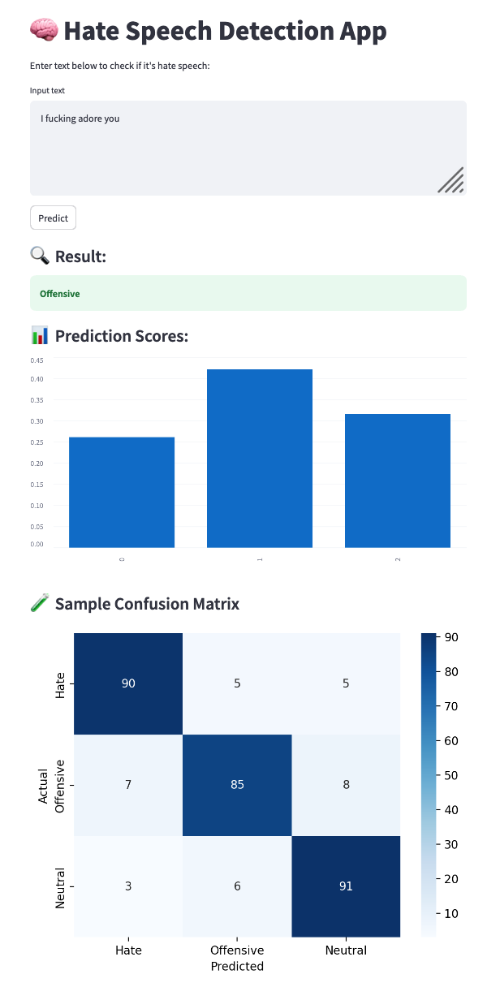

Hate Speech Detection with BERT
===============================

A machine learning project for detecting hate speech using a fine-tuned BERT model. 
Built with TensorFlow, Transformers, and Streamlit.

Project Objectives
------------------
- Content Moderation: Automatically detect and remove hate speech or offensive content from online platforms.
- Education & Awareness: Flag harmful content and encourage responsible digital behavior.

Project Structure
-----------------
hate-speech-detection/
├── data/                  # Dataset files (train/test/labeled/tweet)
├── models/                # Pretrained model files (.h5) - stored externally
├── notebooks/             # Jupyter notebooks for training/evaluation
├── reports/               # PDF reports and presentation
├── src/                   # Source code for training and Streamlit app
├── README.md
├── requirements.txt
├── .gitignore

Installation
------------
Clone the repository and install required packages:

    git clone https://github.com/YOUR_USERNAME/hate-speech-detection.git
    cd hate-speech-detection
    pip install -r requirements.txt

Pretrained Model Weights
------------------------
Due to GitHub's file size limit (100MB), model weights are not included in this repository.

Please download the `.h5` model files from Google Drive and place them inside the `models/` folder:

<<<<<<< HEAD
Download Pretrained Model Files:
https://drive.google.com/drive/folders/1G_0mCVe8F0vzZK6bKI9TaHZJCpyuY-ka?usp=sharing

Run the App (Streamlit)
-----------------------
Launch the interactive hate speech detection app using:

    streamlit run src/TermProject.py

This will open a web interface to test predictions in real-time.

Jupyter Notebooks
-----------------
Explore model training and evaluation with:

- notebooks/HateSpeechDetectionWithBert.ipynb
- notebooks/Prediction.ipynb

To run:

    jupyter notebook

Dataset
-------
Sourced from: 
https://www.kaggle.com/datasets/mrmorj/hate-speech-and-offensive-language-dataset
=======
## 🚀 Run on Streamlit (optional)
streamlit run src/TermProject.py

## 📸 App Preview

## 🧪 Run with Jupyter
jupyter notebook notebooks/HateSpeechDetectionWithBert.ipynb

## 📊 Example Output
Confusion matrix, F1-score, real-time predictions, and warnings for flagged text.
📄 Reports

Find detailed methodology in /reports/ including proposal, slides, and final report.

Available in `data/`:
- labeled_data.csv
- train.csv
- test.csv
- tweet.csv

Evaluation Metrics
------------------
- Accuracy
- Precision
- Recall
- F1-score
- Confusion Matrix

Reports
-------
Available in `reports/`:
- Proposal.pdf
- Hate Speech Detection Report.pdf
- Hate Speech Detection Slides.pdf

Authors
-------
- San Myint Hlaing 
- Saranya Sangsuk-iem 

License
-------
This project is for educational use only.
